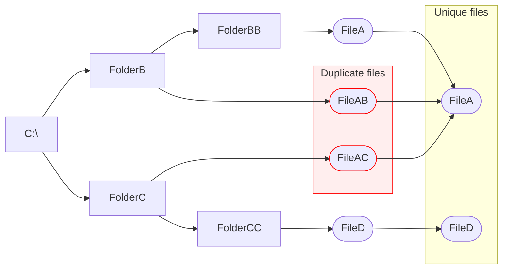

#  Deduplik
A graphical tool to locate and remove duplicated files.

Deduplik allows to clearly visualize duplicates location from a big picture perspective and from a focused file or folder perspective.

Deduplik makes it a breeze to tag files for keeping or removal with just a few clicks.

Matching duplicates is done with an efficient comparison of the file content; not with weak methods such as file names or dates.

> [!CAUTION]
> The purpose of this tool is to **selectively DELETE files!**\
> Altought files are sent by default to the Recycle Bin, make sure you have an **up to date BACKUP** of your files.

## Getting started:
+ Using Windows File Explorer, drag and drop folders unto your Workspace.
+ Scan files by clicking the red button.
+ Tag files with desired action - Keep, Remove or Not Sure for later review.
+ Clean duplicate files by clicking the green button.

> [!TIP]
> Use Keep This and Remove Others 
> + It will tag the current file(s) to Keep 
> + It will also tag the 'other' corresponding duplicate file to Remove
>   
> All that with just one click!

> [!IMPORTANT]
> Everything in Deduplik is done using the mouse\
> With some keyboard shortcuts here and there...
> * Left click: Object selection.
> * Richt click: Action popup.
> * Double click: Open Explorer.
> * Hover to get an informative tooltip.

## Installation:
Download and Unzip the release to the folder of your choice.\
Look for and launch "CodeByStef.Shell.Deduplik.exe".\
You'll need the .NET Desktop Runtime 8.0 installed.\
(https://dotnet.microsoft.com/en-us/download/dotnet)

## Demo files
To get a quick start using Deduplik, unzip “Demo files.zip” and scan it.
The demo files are set with a few duplicate scenarios.

Deduplik is Free and Open Source Software licensed under the GPL.
